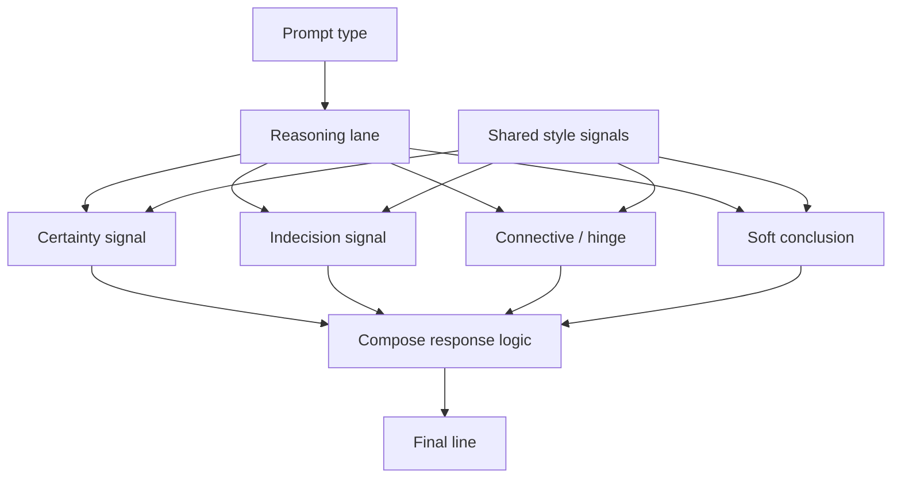

# Probaboracle

Probaboracle is an unhelpful mini chatbot that's "probably" an "oracle", which  
is more or less how it responds.

Probaboracle is an applied AI research engineering project continuing my
hypotheses about binary evaluation discipline, minimal config, and systems
design. It is a local CLI mini app first: lightweight in surface area, but
built on the same runtime logic as Polinko at a smaller scale, with
agent-backed generation, a local runtime, and a CLI-first operator surface.

The prompt surface is fixed by design. It accepts predetermined inputs for
`what`, `when`, `why`, and `where`, along with a runtime direction that shapes
the app's guardrails without collapsing into reinforced restrictions.

Those predetermined prompts let the model reason inside a matched scope so its
behaviour stays aligned with its intended shape. As a mini chatbot with a
narrow scope and purpose, Probaboracle uses one generation node to constrain
the reasoning lane while still allowing word generation beyond its lightweight
shell.

At no point should it imply guidance, help, reassurance, or understanding.  
Responses should stay vague, answer-shaped, and non-concrete.

## Pipeline Diagram

The canonical Mermaid pipeline diagram lives in
[docs/diagrams/PIPELINE.md](./docs/diagrams/PIPELINE.md).



The current runtime reasons through certainty words, indecision words,
connective articles or hinges, and soft conclusions before resolving to one
final line. All prompt types draw from one shared style-signal resource, and
those signals are cues for synthesis rather than a fixed word bank. The words
are still generated in one model call; prompt type matches the reasoning
scope, while the model handles the final sentence logic.

## Current Shape

- Python CLI runtime
- OpenAI Agents SDK
- local SQLite eval store
- tracked governance/runtime docs
- no UI shell, API, auth, or deployment scaffold in the initial slice

## Commands

1. Create the local environment and install the app:

```bash
make install
```

1. Run one oracle lane:

```bash
make ask PROMPT=what
```

Peanutbrain shortcuts:

```bash
make env
make what
make when
make why
make where
make eval-when-5
```

1. Initialise the eval database:

```bash
make eval-init
```

1. Generate local eval samples:

```bash
make sample PROMPT=when COUNT=5
```

1. List recent outputs:

```bash
make list PROMPT=when LIMIT=10
```

1. Judge outputs:

```bash
make judge ID=1 VERDICT=pass NOTE="deadpan and non-concrete"
make pass ID=1 NOTE="deadpan and non-concrete"
make fail ID=2 NOTE="too concrete"
```

## Docs

- [docs/governance/CHARTER.md](./docs/governance/CHARTER.md)
- [docs/governance/DECISIONS.md](./docs/governance/DECISIONS.md)
- [docs/runtime/ARCHITECTURE.md](./docs/runtime/ARCHITECTURE.md)
- [docs/runtime/RUNBOOK.md](./docs/runtime/RUNBOOK.md)
- [docs/governance/SESSION_HANDOFF.md](./docs/governance/SESSION_HANDOFF.md)
- [docs/diagrams/PIPELINE.md](./docs/diagrams/PIPELINE.md)
