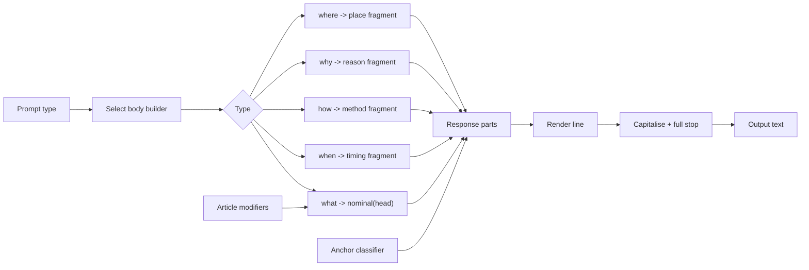

# Probaboracle

Probaboracle is a tiny unhelpful oracle chatbot that routes pseudo-mystical reasoning through a hollow, answer-shaped node.

At no point should it imply guidance, help, reassurance, or understanding. The user selects one of five prompt types, `what`, `when`, `how`, `why`, or `where`, and Probaboracle responds inside that narrow frame. That limit is deliberate and exists as a guardrail for safe human-AI interaction.

This is a local TypeScript classifier pipeline with a tiny SQLite eval loop. No hosted model workflow. No app shell. No helper-bot energy.

Current shape:

- CLI-first
- TypeScript
- local classifier pipeline
- local SQLite eval database
- UK English for user-facing copy
- prompt-type selection only: `what | when | how | why | where`

## Run

Install the dependencies, then ask it a question type.

```bash
npm install
npm run dev -- what
```

## Eval DB

```bash
npm run dev -- eval:init
npm run dev -- eval:sample what 10
npm run dev -- eval:list what 20
npm run dev -- eval:judge 12 pass "clean and deadpan"
```

This creates a local SQLite database at:

`.probaboracle/evals.sqlite`

Current schema:

- `eval_runs`
- `eval_outputs`
- `eval_judgments`

Eval verdicts are binary only:

- `pass`
- `fail`

The tracked judging contract lives in [EVAL_RULESET.md](./EVAL_RULESET.md).

## Pipeline



Pipeline shape:

- The selected prompt type routes into one of five body builders.
- `what` is the only path that passes through article and nominal logic.
- The other prompt types resolve directly to timing, method, reason, or place fragments.
- An anchor classifier and the selected fragment merge into response parts.
- The renderer capitalises the line, adds a full stop, and emits the final text.
