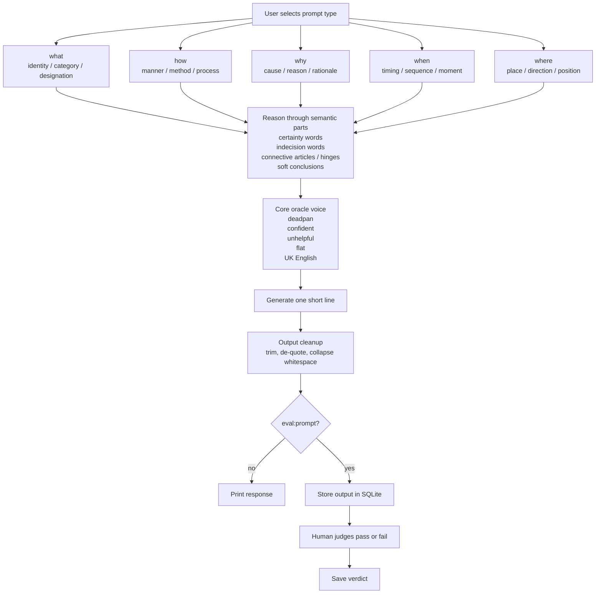

# Pipeline Diagram

This is the canonical diagram for the Probaboracle response pipeline.

## Shape

- The prompt type selects a reasoning lane, not a fragment bank.
- Each lane narrows the kind of thing the answer is about.
- The live part comes from a few semantic nodes working together, not from static full phrases and not from totally loose freeform drift.
- Manual eval stays local and binary: `pass` or `fail`.
