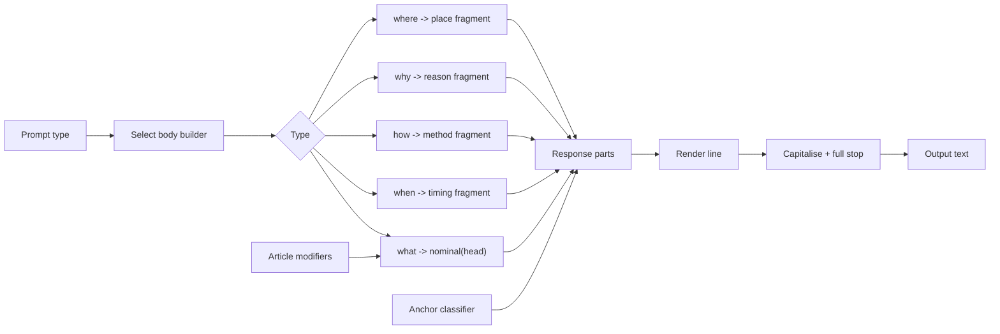

# Pipeline Diagram

This is the canonical diagram for the Probaboracle response pipeline.

## Shape

- The selected prompt type routes into one of five body builders.
- `what` is the only path that passes through article and nominal logic.
- The other prompt types resolve directly to timing, method, reason, or place fragments.
- An anchor classifier and the selected fragment merge into response parts.
- The renderer capitalises the line, adds a full stop, and emits the final text.
