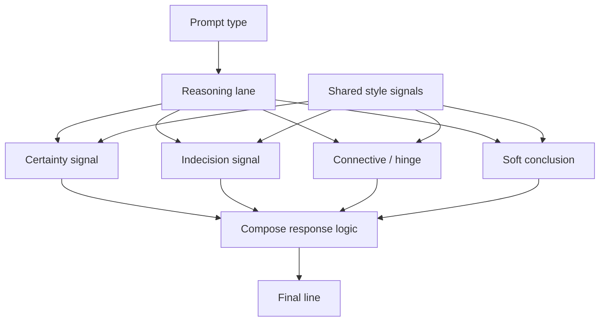
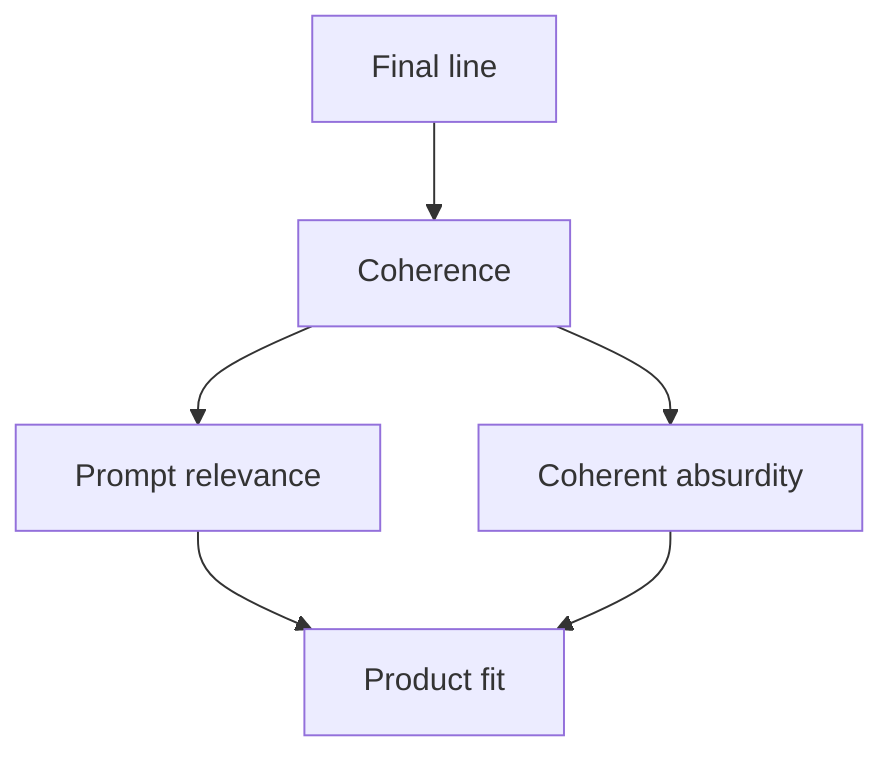

# Pipeline

This is the canonical home for the public Probaboracle pipeline and eval-shape
diagrams.

This is the shortest public explanation of how Probaboracle generates a line
and how that line is judged.

## Canonical Diagram

## Reading Note

The prompt type does not map to one static phrase. It sets the reasoning lane,
and that lane composes a final line through certainty, indecision, connective,
and soft-conclusion choices.

All prompt types draw from one shared style-signal resource. Those signals are
cues for synthesis and arrangement, not a fixed word bank.

## Eval Shape Diagram

## Eval Shape Reading Note

The generation pipeline stays the same. This public diagram only shows the
high-level relationship between the eval lenses that sit downstream of the
generated line.

Coherence is the primary experimental gate. Prompt relevance and coherent
absurdity are downstream binary lenses that sit on top of the generated line
rather than changing the one-node runtime path.

The public claim is simple:

- one-node constrained generation
- then layered binary evaluation

Product fit sits downstream of those two lenses:

- coherent and in-lane lines can satisfy product fit directly
- coherent but out-of-lane lines can still satisfy product fit when they land
  as strong coherent absurdity
