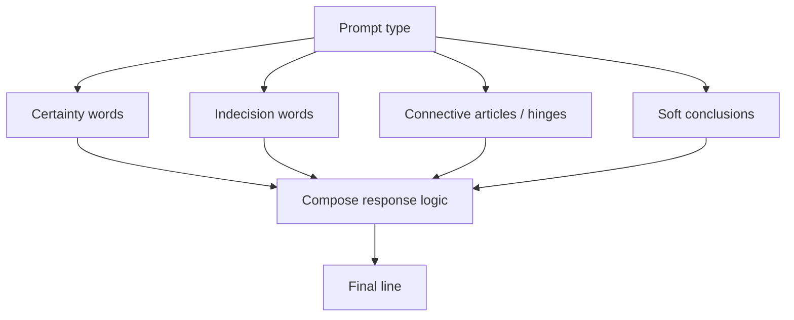

# Pipeline

This is the canonical home for the Probaboracle pipeline diagram.

This is the active reasoning shape for the current runtime.

## Canonical Diagram

## Reading Note

The prompt type does not map to one static phrase. It sets the reasoning lane,
and that lane composes a final line through certainty, indecision, connective,
and soft-conclusion choices.
