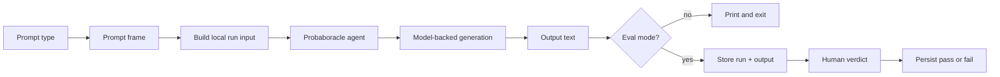

# Pipeline Diagram

This is the canonical diagram for the Probaboracle response pipeline.

## Shape

- The selected prompt type resolves into a compact prompt frame.
- The local CLI turns that frame into one run input for the agent.
- The agent generates the response instead of stitching fragments together.
- Manual eval stays local and binary: `pass` or `fail`.
