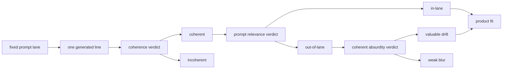

# Research Beta 4.1: Coherence + Coherent Absurdity

## What This Beta Asked

Can a coherent out-of-lane line still be a very good Probaboracle response?

Beta 4.1 keeps the Beta 4 architecture, but raises the coherence bar. A line only passes coherence when it resolves as one sentence with one dominant reasoning lane.

For short Probaboracle lines, this version also uses a hard punctuation shortcut:

- `0-1` comma = normal
- `2+` commas = fail

## Short Answer

Yes, but rarely.

Some prompt-irrelevant lines are still valuable. They are coherent, interesting, and recognisably Probaboracle. That makes coherent absurdity a real product signal.

It is also a selective signal. Most coherent relevance fails are still weak blur, not missed value.

## Eval Shape

The useful path is:

1. Generate one fixed-lane response.
2. Judge coherence.
3. If coherent, judge prompt relevance.
4. If coherent but out-of-lane, judge coherent absurdity.
5. Let product fit sit downstream of those lenses.

## Current Signal

The primary Beta 4.1 pocket is:

- `coherence = pass`
- `relevance = fail`

That pocket is still the main Beta 4.1 instrument, but the closing `when`
stress rerun did not enter it at all:

- `0 pass / 0 fail / 0 pending` in the fresh coherence-pass relevance-fail slice

So the latest useful signal is not about new coherent-absurdity wins. It is
about lane stability under the stricter coherence rule.

Fresh tandem rerun (`1763-2268`) product surface:

- `347 pass / 159 fail / 0 pending`

Fresh lane split:

- `what`: `81 pass / 3 fail`
- `when`: `107 pass / 146 fail`
- `where`: `84 pass / 0 fail`
- `why`: `75 pass / 10 fail`

## Long-Run Read

The cleanest follow-up method is still serial, but extended reruns now work best as a tandem pair:

- one product
- immediate tandem judgment
- next product
- stale product backlog archived out of the active surface first

Small taste checks are not enough. Under Beta 4.1:

- `25+` rows is the minimum useful checkpoint
- `50-100` rows, or about one hour, is the real long-run surface
- extra `when` pressure should stay in the mix because it stress-tests the current coherence rule

The current tracked long run is now judged through row `2268`.

The latest tandem rerun archived `385` stale product-pending rows before relaunch, then kept the fresh product queue at `0` all the way through the run.

That rerun sharpened three lane reads:

- `when` is still the main drag lane:
  - `113` failures from `stacked timing fragments`
  - `33` failures from semicolon-led timing drift
- `why` mostly works when it stays plain:
  - pass example: `probably a reason, or something adjacent to one.`
  - fail example: `probably a reason, or perhaps not; i'm saying it resembles a reason without settling anything.`
- `where` is now the cleanest lane, and `what` is close behind:
  - `where` pass example: `probably the unclaimed edge of it, though not where you could keep it.`
  - `what` pass example: `probably a curve that hints at a shape without ever becoming one.`

The closing dedicated `when` rerun used rows `2737-3391`:

- `655` rows total
- `286 pass / 369 fail / 0 pending`
- fail clusters stayed narrow:
  - `266` `stacked timing fragments`
  - `102` `semicolon pile and unresolved timing drift`
  - `1` `awkward temporal phrasing`

That closing slice did not change the Beta `4.1` answer. It closed it.
Coherent absurdity remained real but sparse; the active open problem had
shifted to what to do with one stable fail family once it had been characterized
hard enough.

## Why It Matters

This beta separates three things that were easy to blur together:

- incoherence
- prompt drift
- valuable coherent drift

That distinction matters because out-of-lane is not automatically low-value. Probaboracle can sometimes miss the selected lane and still produce a strong oracle response.

The inverse is just as important: coherence does not rescue everything. Coherent absurdity earns its own lane because it is rare.

## What Changed Next

Product fit now sits downstream of coherence, relevance, and coherent absurdity
rather than trying to stand in for all of them at once.

The next architecture change is Beta `5.0`:

- `pass / fail`
- if `fail`, decide `retain / evict`
- rerun
- `pass / fail`
