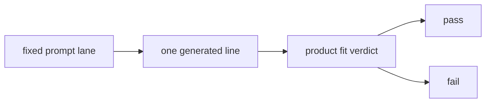

# Research Beta 1.0: Product Fit Only

## What This Beta Asked

Can a fixed-prompt oracle produce lines that feel like good Probaboracle?

## Short Answer

Yes, as a product-shaping pass.

No, as a research architecture.

The single product-fit verdict helped tune the voice, but it was carrying too
many jobs at once.

## Eval Shape

- product fit only
- `pass` or `fail`

## Diagram

## What It Showed

- pushing the tone toward deadpan, vague, and unhelpful
- finding obvious misses quickly
- shaping the product voice

## What It Could Not Separate

- coherent sentence reasoning
- prompt-lane relevance
- valuable absurd drift

## What Changed Next

Coherence was pulled out as its own primary experimental gate.
