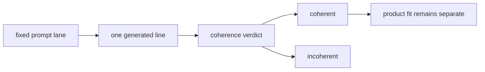

# Research Beta 2.0: Coherence First

## What This Beta Asked

Can one-node constrained generation produce coherent sentences inside the fixed
prompt surface?

## Short Answer

Yes. This was the real experiment.

Coherence proved much stronger than product fit, which showed that sentence
reasoning and product taste needed to be judged separately.

## Eval Shape

- coherence first
- `pass` = coherent sentence
- `fail` = incoherent sentence

## Diagram

## Current Signal

On the current corpus snapshot, coherence is much stronger than product fit:

- coherence: `640 pass / 98 fail`
- product fit: `340 pass / 350 fail`

That split matters. It shows the model can often hold together sentence
reasoning even when it misses the stricter product taste gate.

## Failure Shape

The failures do not scatter randomly. They cluster, especially in temporal
phrasing inside the `when` lane.

## Why It Matters

This beta established the core claim:

Probaboracle can reason coherent sentence shapes inside constrained guardrails
without needing a larger prompt pile or a wider UI surface.

## What Changed Next

Prompt relevance became a downstream question rather than part of the same
verdict.
