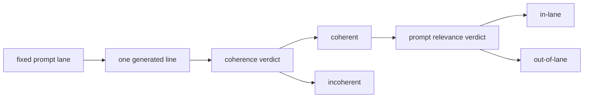

# Research Beta 3.0: Coherence + Prompt Relevance

## What This Beta Asked

Once a line is coherent, does it stay in-lane for the selected prompt?

## Short Answer

Usually, yes.

Prompt relevance turned out to be narrower than product fit and different from
coherence. It asks which reasoning lane is actually leading the sentence.

## Eval Shape

- coherence first
- prompt relevance second
- both stay binary

## Diagram

## Current Signal

Current snapshot:

- relevance: `632 pass / 106 fail / 0 pending`

A useful early result came from the `when` lane:

- many apparent misses were actually boundary cases
- temporal signal could still outrank a small spatial leak
- coherent lines were often still recognisably in-lane

A sharper later result came from the `what` lane:

- relevance: `127 pass / 9 fail`
- product fit on the same lane: `70 pass / 66 fail`
- `57` product-fail rows still passed relevance

That `what` sweep made the split plain. Most lines stayed clearly shape-led
even when they missed the stricter Probaboracle taste gate. The real relevance
fails were a small pocket where `here`, `there`, or `elsewhere` stopped being
secondary texture and started steering the sentence.

The `where` lane then closed cleanly:

- relevance: `109 pass / 26 fail`
- coherence on the same lane: `109 pass / 26 fail`

That mattered for a different reason. It showed that `where` was not really
failing on lane control. Once those lines were coherent, they were already
spatially in-lane. The drag there was sentence quality, not prompt drift.

## Why It Matters

This beta separates:

- broken sentence logic
- prompt-lane drift

That makes the research cleaner and keeps coherence as the primary question.

## What Changed Next

Coherent absurdity also emerged as a separate class rather than being flattened
into relevance failure.
