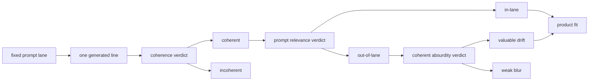

# Research Beta 4.0: Coherence + Coherent Absurdity

## What This Beta Asked

Can a coherent out-of-lane line still be a very good Probaboracle response?

## Eval Shape

- coherence first
- relevance as one downstream lens
- coherent absurdity as another downstream lens
- product fit can still be satisfied through coherent absurdity
- when isolating this gate, use one product per run and judge it immediately

## Diagram

## Main Finding

Yes. Some prompt-irrelevant lines are not junk. They are coherent, lane-led
enough to hold together, and then they land a sideways oracle punchline.

But this class is smaller and stricter than it first looked.

That is not a bug class to erase. It is a distinct research signal, but it is
not a blanket rescue lane for every coherent relevance fail.

## Current Signal

The meaningful evaluation surface is the `coherence = pass` and
`relevance = fail` pocket.

That pocket is now fully swept:

- `2 pass / 13 fail / 0 pending`

The broader absurdity table is larger:

- `5 pass / 13 fail / 788 pending`

but that is not the primary instrument for this beta.

The two passes are strong precisely because they are rare:

- `There, or neither here nor there; perhaps a silhouette, perhaps not.`
- `it's probably the edge case, or perhaps not, which settles nothing.`

Outside the coherence-pass relevance-fail pocket, absurdity is not the
question we are asking.

The strongest signal for this beta came from serial single-product runs rather
than from broader pooled sweeps. That method made it easier to see whether one
line, by itself, earned coherence and absurdity at the same time.

## Why It Matters

This beta shows that out-of-lane is not the same as low-value.

Probaboracle can produce responses that are:

- coherent
- product-interesting
- slightly drifted
- still recognisably good oracle behaviour

It also shows the inverse: many coherent relevance fails are still just weak
blur. The absurdity class earns its own lane because it is selective.

## What Changed Next

Product fit now sits downstream of coherence, relevance, and coherent
absurdity rather than trying to stand in for all of them at once.
