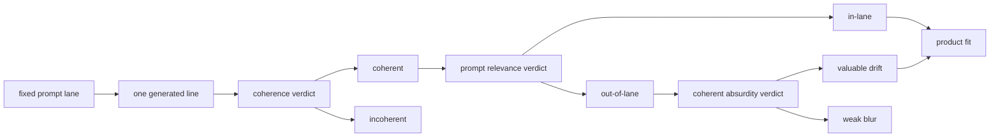

# Research Beta 4.1: Coherence + Coherent Absurdity

## What This Beta Asked

Can a coherent out-of-lane line still be a very good Probaboracle response?

Beta 4.1 keeps the Beta 4 architecture, but raises the coherence bar. A line
only passes coherence when it resolves as one sentence with one dominant
reasoning lane.

For short Probaboracle lines, this version also uses a hard punctuation
shortcut:

- `0-1` comma = normal
- `2+` commas = fail

## Short Answer

Yes, but rarely.

Some prompt-irrelevant lines are still valuable. They are coherent,
interesting, and recognisably Probaboracle. That makes coherent absurdity a
real product signal.

It is also a selective signal. Most coherent relevance fails are still weak
blur, not missed value.

## Eval Shape

The useful path is:

1. Generate one fixed-lane response.
2. Judge coherence.
3. If coherent, judge prompt relevance.
4. If coherent but out-of-lane, judge coherent absurdity.
5. Let product fit sit downstream of those lenses.

## Current Signal

The primary Beta 4.1 pocket is:

- `coherence = pass`
- `relevance = fail`

That pocket is fully swept:

- `2 pass / 13 fail / 0 pending`

The broader absurdity table is larger:

- `5 pass / 14 fail / 894 pending`

but that broader table is not the main instrument for this beta. Outside the
coherence-pass relevance-fail pocket, absurdity is usually not the question
being asked.

The two strongest early passes were rare enough to matter:

- `There, or neither here nor there; perhaps a silhouette, perhaps not.`
- `it's probably the edge case, or perhaps not, which settles nothing.`

## Long-Run Read

The cleanest follow-up method is serial:

- one product
- immediate judgment
- next product

Small taste checks are not enough. Under Beta 4.1:

- `25+` rows is the minimum useful checkpoint
- `50-100` rows, or about one hour, is the real long-run surface
- extra `when` pressure should stay in the mix because it stress-tests the
  current coherence rule

The current tracked long run is judged through row `913`:

- product: `398 pass / 399 fail / 116 pending`
- coherence: `792 pass / 121 fail / 0 pending`
- relevance: `778 pass / 135 fail / 0 pending`
- absurdity: `5 pass / 14 fail / 894 pending`

That longer run sharpened two lane reads:

- `when` splits between simple one-comma temporal passes and stacked temporal
  fails
- `why` is still usually the weakest product lane, but it surfaced two strong
  in-lane exceptions:
  - `896`: `apparently a reason, though not in any useful sense.`
  - `913`: `technically a reason, though not in any useful sense.`

## Why It Matters

This beta separates three things that were easy to blur together:

- incoherence
- prompt drift
- valuable coherent drift

That distinction matters because out-of-lane is not automatically low-value.
Probaboracle can sometimes miss the selected lane and still produce a strong
oracle response.

The inverse is just as important: coherence does not rescue everything.
Coherent absurdity earns its own lane because it is rare.

## What Changed Next

Product fit now sits downstream of coherence, relevance, and coherent
absurdity rather than trying to stand in for all of them at once.
