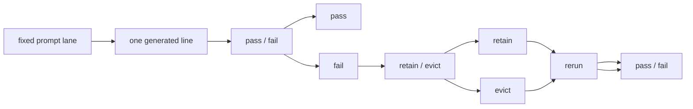

# Research Beta 5.0: Retain + Evict

## What This Beta Asked

Once a recurring fail family is obvious, should it stay in the active lane as
live evidence, or has it earned an upstream correction?

## Short Answer

This beta separates evidence from correction.

`Fail` is still the first verdict. But after `fail`, the next question is no
longer only "does this row fail?" It is also "does this family stay active
under the current rule, or has it earned eviction?"

Beta `5.0` opens with the dominant `when` fail family still in `retain`, not
`evict`.

## Eval Shape

The useful path is:

1. Generate one fixed-lane response.
2. Judge `pass / fail`.
3. If `fail`, decide:
   - `retain`
   - `evict`
4. Rerun under the resulting lane.
5. Judge `pass / fail` again.

## Current Signal

This beta opens from the closing `Research Beta 4.1` `when` stress lane:

- rows `2737-3391`
- `655` rows total
- `286 pass / 369 fail / 0 pending`
- coherent absurdity pocket: `0 pass / 0 fail / 0 pending`

The fail family stayed narrow:

- `266` `stacked timing fragments`
- `102` `semicolon pile and unresolved timing drift`
- `1` `awkward temporal phrasing`

The key carry-forward is not a new prompt or a wider runtime. It is the
decision boundary between:

- repeated failure as active evidence
- repeated failure as a family that has earned upstream removal or correction

## Why It Matters

This beta separates three things that are easy to blur together:

- row-level failure
- family-level retention
- runtime-level correction

That distinction keeps the queue honest.

It stops two bad habits:

- premature tweaking after one noisy run
- endless re-judging of a family that no longer belongs in the active lane

It also creates a cleaner threshold question for the next slice:

- is `when` still teaching us something under `retain`
- or has the family stabilized enough to earn `evict`

## What Changed Next

This beta promotes `retain / evict` into the tracked research architecture.
