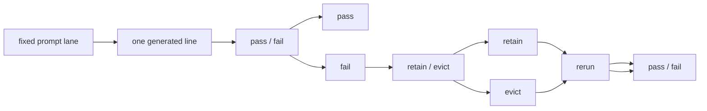

# Research Beta 5.1: Retain + Evict

## What This Beta Asked

Once a recurring fail family is obvious, should it stay in the active lane as
live evidence, or has it earned an upstream correction?

## Short Answer

This beta separates evidence from correction.

`Fail` is still the first verdict. But after `fail`, the next question is no
longer only "does this row fail?" It is also "does this family stay active
under the current rule, or has it earned eviction?"

Beta `5.1` keeps the same retain-evict question and now shows two distinct
eviction shapes:

- the dominant `when` fail family earned `evict`, and a narrow post-evict
  rerun confirmed the correction materially improved the lane
- the dominant `why` fail family also earned `evict`, but at the product layer
  rather than through lane loss

## Eval Shape

The useful path is:

1. Generate one fixed-lane response.
2. Judge `pass / fail`.
3. If `fail`, decide:
   - `retain`
   - `evict`
4. Rerun under the resulting lane.
5. Judge `pass / fail` again.

## Current Signal

This beta opens from the closing `Research Beta 4.1` `when` stress lane:

- rows `2737-3391`
- `655` rows total
- `286 pass / 369 fail / 0 pending`
- coherent absurdity pocket: `0 pass / 0 fail / 0 pending`

The fail family stayed narrow:

- `266` `stacked timing fragments`
- `102` `semicolon pile and unresolved timing drift`
- `1` `awkward temporal phrasing`

The key carry-forward is not a new prompt or a wider runtime. It is the
decision boundary between:

- repeated failure as active evidence
- repeated failure as a family that has earned upstream removal or correction

The deciding rerun under Beta `5.0` then covered rows `3392-4097`:

- `706` rows total
- `317 pass / 389 fail / 0 pending`

The fail family stayed narrow again:

- `272` `stacked timing fragments`
- `85` `semicolon pile and unresolved timing drift`
- `32` `awkward temporal phrasing`

That was enough to move the lane from:

- `retain`

to:

- `evict`

The post-evict confirmation rerun then covered rows `4098-4197`:

- `100` rows total
- `97 pass / 3 fail / 0 pending`

The note mix shifted hard toward clean passes:

- `83` `good scheduling refusal`
- `14` `plain when line`
- `2` `awkward temporal phrasing`
- `1` `stacked timing fragments`

The old dominant failures collapsed:

- `semicolon pile and unresolved timing drift`: `0`
- `stacked timing fragments`: `1`

The first long `why` retain rerun then covered rows `4198-4642`:

- `445` rows total
- `77 pass / 368 fail / 0 pending`

The dominant `why` failures stayed narrow:

- `292` `duplicate why fallback`
- `65` `stacked hinge accumulation`
- `11` `too fallback-bare for product pass`

The sidecar surface mostly held:

- coherence: `380 pass / 65 fail`
- relevance: `380 pass / 0 fail`

That was enough to move `why` from:

- `retain`

to:

- `evict`

The first narrow `why` post-evict attempt then covered rows `4643-4723`:

- `81` rows total
- `81 pass / 0 fail / 0 pending`

The old failure family disappeared, but the new pass surface overcollapsed:

- `66` `good useless reason`
- `15` `strong why lane`

That means the attempted fix did remove the old duplicate-fallback rut, but it
replaced it with one dominant pass shape rather than a healthy lane.

Beta `5.1` keeps that same architecture question active, but tightens the live
instruction surface before the next `why` rerun:

- hard-coded phrase scaffolds are removed
- the instruction path stays shape-first
- the next fresh `why` evidence slice belongs to `5.1`, not `5.0`

## Why It Matters

This beta separates three things that are easy to blur together:

- row-level failure
- family-level retention
- runtime-level correction

That distinction keeps the queue honest.

It stops two bad habits:

- premature tweaking after one noisy run
- endless re-judging of a family that no longer belongs in the active lane

It also creates a cleaner threshold question for the next slice:

- not whether `when` earned `evict`
- and not whether the first correction works at all
- and not whether `why` actually has a repeat problem
- but what the smallest correct `why` correction is now that the product-level
  fallback family has earned removal without collapsing the lane into one pass
  rut

## What Changed Next

This beta promotes `retain / evict` into the tracked research architecture,
closes with `when` earning `evict`, confirms the first narrow `when`
correction under the same Beta `5.0` frame, and then shows that `why` can
also earn `evict` for a different reason: product-level duplicate fallback.

`Research Beta 6.0` now carries the next method question: how to judge bounded
non-OCR runs once run-level seam density matters more than single-row replay.
