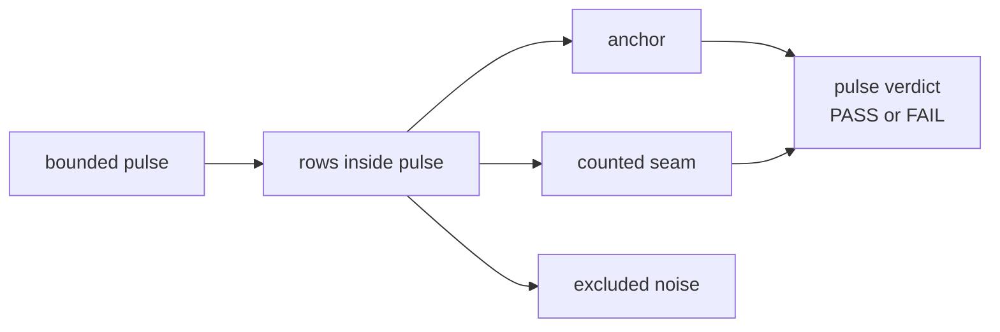

# Pre-Beta 6.0: Fail-Pressure Pulse

## What This Pre-Beta Asks

Should Probaboracle treat a bounded non-OCR run as the real binary unit once
seam density matters more than single-row replay?

## Status

Maybe, and the current `5.1` line is strong enough to make the question worth
staging explicitly.

`Research Beta 5.1` proved that row-level `retain / evict` can separate
evidence from correction without letting the instruction surface collapse into
hard-coded phrase scaffolds. This pre-beta note asks whether the next method
step should move the binary judgment up one level:

- the pulse becomes the binary unit
- the rows become evidence inside the pulse

## Eval Shape

This is not `Research Beta 6.0` yet.

It is the staging contract for a possible `6.0` promotion.

The proposed pulse shape for Probaboracle is:

- bounded non-OCR run
- start small:
  - around `15` rows
- row evidence is judged first as:
  - `anchor`
  - `counted seam`
  - `excluded noise`
- the pulse verdict is binary:
  - `PASS`
  - `FAIL`

Counted pulse rules:

- more anchors than counted seams: `PASS`
- more counted seams than anchors: `FAIL`
- tie: `FAIL`

Exclusion rules:

- raw pulse size stays visible
- counted pulse size stays visible
- every excluded row needs a narrow reason
- excluded rows stay reviewable after the pulse

## Diagram

## What This Would Change

If this graduates into `Research Beta 6.0`, Probaboracle would change the unit
of judgment for bounded non-OCR runs:

- `Beta 5.1`:
  - row-level `PASS / FAIL`
  - row-level `RETAIN / EVICT`
- `Beta 6.0` candidate:
  - row-level evidence labeling inside the pulse
  - pulse-level `PASS / FAIL`

That would make run-level shape harder to fake:

- one lucky row could not make the whole run look healthy
- seam density would matter more than isolated wins
- exclusion review would become part of pulse hygiene

## Why It Matters

The closed `5.1` line already showed a result that invites pulse judgment:

- `why` earned `evict`
- the first post-evict rerun removed the old fail family
- but the rerun collapsed into one dominant pass rut:
  - `good useless reason`: `66`
  - `strong why lane`: `15`

That is exactly the kind of result that makes run-level density interesting.

The row-level method already proved the seam is real. Pulse judgment would ask
a stricter question:

- does this bounded run actually pass under fail pressure
- or does counted seam density still outweigh the anchors

## What It Still Needs

Before this becomes `Research Beta 6.0`, Probaboracle still needs:

- a tight evidence taxonomy for:
  - `anchor`
  - `counted seam`
  - `excluded noise`
- a narrow exclusion reason set
- one first promoted pulse target:
  - likely a fresh bounded `why` run
- explicit raw-count and counted-count reporting in the research surface

## What Would Promote It

This becomes `Research Beta 6.0` only when Probaboracle starts the first real
fail-pressure pulse run.

Promotion boundary:

1. pulse contract is accepted as the next eval unit
2. the first bounded pulse is launched
3. the research index flips from closed `5.1` to active `6.0`
4. pulse evidence, not just staging text, becomes the current method
