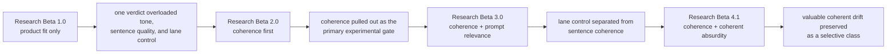
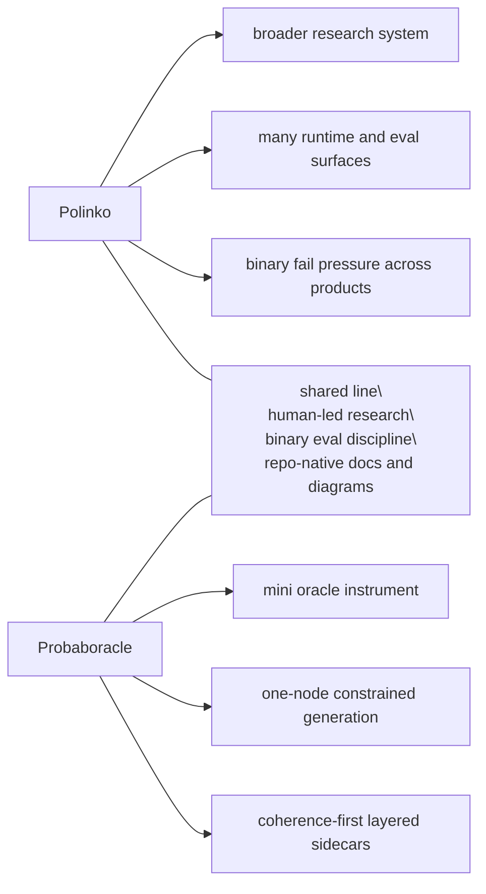

# Research

Probaboracle keeps the tracked research lane small on purpose.

Each beta is a distinct eval approach. This folder preserves the method shifts
that changed what the evidence means.

Raw run notes, operator poking, and private scratch material stay in the local
`docs/peanut/` lane.

## Current Beta

Current tracked research beta:

- `Research Beta 4.1`
- `coherence + coherent absurdity`

Current question:

Can a coherent out-of-lane line still count as strong oracle behaviour?

Current finding:

- one-node constrained generation can hold sentence coherence under the fixed
  prompt surface
- prompt relevance is a downstream lens, not a proxy for sentence quality
- coherent absurdity is a small selective class:
  - `2 pass / 13 fail` in the meaningful coherence-pass relevance-fail pocket
- the long serial run through row `913` strengthened the stricter coherence
  rule
- `when` now splits between simple one-comma temporal passes and stacked
  temporal fails
- `why` remains the weakest product lane overall, but surfaced rare novel
  passes:
  - `896`: `apparently a reason, though not in any useful sense.`
  - `913`: `technically a reason, though not in any useful sense.`

Current clean probe:

- long serial single-product runs
- `25+` rows as the minimum useful checkpoint
- `50-100` rows, or about one hour, as the real long-run surface
- extra `when` pressure while testing the current coherence rule

## Beta Map

| Beta | Question | What Changed |
| --- | --- | --- |
| `Research Beta 1.0` | Does it feel like good Probaboracle? | Product fit shaped the voice, but overloaded one verdict. |
| `Research Beta 2.0` | Is the sentence coherent? | Coherence became the primary experimental gate. |
| `Research Beta 3.0` | Is a coherent line in-lane? | Prompt relevance separated lane control from sentence quality. |
| `Research Beta 4.1` | Can coherent drift still be valuable? | Coherent absurdity became a small selective class. |

Read in order:

1. [Research Beta 1.0: Product Fit Only](./BETA_1_PRODUCT_FIT.md)
2. [Research Beta 2.0: Coherence First](./BETA_2_COHERENCE_FIRST.md)
3. [Research Beta 3.0: Coherence + Prompt Relevance](./BETA_3_PROMPT_RELEVANCE.md)
4. [Research Beta 4.1: Coherence + Coherent Absurdity](./BETA_4_COHERENT_ABSURDITY.md)

## How To Read The Betas

These betas are research architectures. They are not app release versions,
package versions, branch names, or one more sweep.

Each beta marks a real change in what the evaluation is asking:

- `Research Beta 1.0` shaped the product voice
- `Research Beta 2.0` established the core experimental gate
- `Research Beta 3.0` separated lane control from sentence coherence
- `Research Beta 4.1` preserves the selective value of coherent drift while
  holding coherence to a stricter sentence-resolution bar

Later betas do not erase earlier ones. They narrow what each verdict is allowed
to mean.

## Cross-Beta Flow

## Plans

Plans are useful, but they are not evidence. They do not become active method
until the repo earns them.

Parked lanes:

- provider portability:
  - keep OpenAI-native behaviour stable if the runtime surface later widens
  - leave room for an Azure-compatible path if it becomes necessary
- research visuals:
  - keep per-beta diagrams in tracked docs
  - only add a polished cross-beta Sankey if the era-to-era story needs it
- future betas:
  - promote a new beta only when the eval architecture changes materially
  - do not turn one more sweep into a fake beta

## Polinko Contrast

Probaboracle is part of the same line of work as Polinko, but it is a smaller
instrument.

