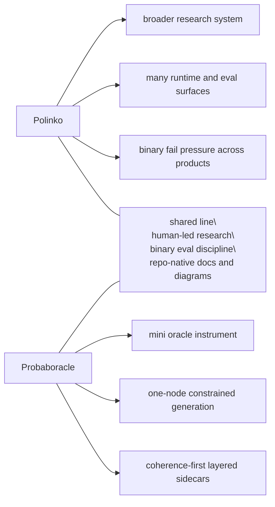

# Research

Probaboracle keeps the tracked research lane small on purpose.

Each beta or staged note is a distinct eval approach. This folder preserves the
method shifts that changed what the evidence means.

Raw run notes, operator poking, and private scratch material stay in the local `docs/peanut/` lane.

## Current Stage

Current research lane:

- `Research Beta 6.0`
- `fail-pressure pulse`

Most recently closed beta:

- `Research Beta 5.1`
- `retain + evict`

Current pulse question:

Can Probaboracle hold its shape across a bounded one-prompt eval run?

Current finding:

- `Research Beta 5.1` proved the row-level retain-evict architecture under the
  cleaned instruction surface
- `when` earned `evict`, and the first narrow post-evict correction held:
  - deciding rerun: `317 pass / 389 fail / 0 pending`
  - confirmation rerun: `97 pass / 3 fail / 0 pending`
  - old dominant failures collapsed to:
    - `semicolon pile and unresolved timing drift`: `0`
    - `stacked timing fragments`: `1`
    - `awkward temporal phrasing`: `2`
- `why` also earned `evict`, but the first post-evict fix overcollapsed:
  - deciding rerun: `77 pass / 368 fail / 0 pending`
  - dominant fail mix:
    - `duplicate why fallback`: `292`
    - `stacked hinge accumulation`: `65`
    - `too fallback-bare for product pass`: `11`
  - first post-evict rerun: `81 pass / 0 fail / 0 pending`
  - new pass rut:
    - `good useless reason`: `66`
    - `strong why lane`: `15`
- the next method question is no longer whether `retain / evict` belongs in
  the active line
- `Research Beta 6.0` is active as the next method:
  - run duration: `15` minutes
  - one prompt lane per run
  - default pacing: about one sample per minute
  - row labels are pulse evidence only
  - one `PASS / FAIL` verdict for the whole run
  - first valid run failed:
    - ids: `4850-4863`
    - `1` anchor
    - `13` counted seams
    - `0` excluded
- live reruns are paused until rate limits and prepaid credits are healthy
  again

Current active lane:

- `Research Beta 5.1` is closed as the row-level `retain / evict` baseline
- `Research Beta 6.0` is the active run-level lane
- label rows as `anchor`, `counted_seam`, or `excluded_noise`
- first run verdict: `FAIL`
- next work is planning from the failed pulse, not another live run yet
- keep row-level `5.1` as the comparison surface, not the active method

## Beta Map

| Beta | Question | What Changed |
| --- | --- | --- |
| `Research Beta 1.0` | Does it feel like good Probaboracle? | Product fit shaped the voice, but overloaded one verdict. |
| `Research Beta 2.0` | Is the sentence coherent? | Coherence became the primary experimental gate. |
| `Research Beta 3.0` | Is a coherent line in-lane? | Prompt relevance separated lane control from sentence quality. |
| `Research Beta 4.1` | Can coherent drift still be valuable? | Coherent absurdity became a small selective class. |
| `Research Beta 5.1` | When does a fail family stay active evidence versus earn eviction? | `retain / evict` stays active, with the instruction surface tightened to preserve shape-first lane control. |
| `Research Beta 6.0` | Can a bounded one-prompt run hold shape? | The eval run becomes the binary unit. |

Active pulse lane:

- `Research Beta 6.0`
- [Fail-Pressure Pulse](./BETA_6_FAIL_PRESSURE_PULSE.md)
- staging note: [Pre-Beta 6.0](./PRE_BETA_6_FAIL_PRESSURE_PULSE.md)

Read in order:

1. [Research Beta 1.0: Product Fit Only](./BETA_1_PRODUCT_FIT.md)
2. [Research Beta 2.0: Coherence First](./BETA_2_COHERENCE_FIRST.md)
3. [Research Beta 3.0: Coherence + Prompt Relevance](./BETA_3_PROMPT_RELEVANCE.md)
4. [Research Beta 4.1: Coherence + Coherent Absurdity](./BETA_4_COHERENT_ABSURDITY.md)
5. [Research Beta 5.1: Retain + Evict](./BETA_5_RETAIN_OR_EVICT.md)
6. [Research Beta 6.0: Fail-Pressure Pulse](./BETA_6_FAIL_PRESSURE_PULSE.md)

## How To Read The Betas And Stages

These betas and staged notes are research architectures. They are not app
release versions, package versions, branch names, or one more sweep.

Each beta marks a real change in what the evaluation is asking:

- `Research Beta 1.0` shaped the product voice
- `Research Beta 2.0` established the core experimental gate
- `Research Beta 3.0` separated lane control from sentence coherence
- `Research Beta 4.1` preserves the selective value of coherent drift while holding coherence to a stricter sentence-resolution bar
- `Research Beta 5.1` separates failure evidence from later runtime correction while keeping the live instruction path shape-first
- `Research Beta 6.0` moves bounded non-OCR runs from row-level product
  verdicts to row evidence labels plus one run-level verdict

Later betas do not erase earlier ones. They narrow what each verdict is allowed to mean.

## Cross-Beta Flow

```mermaid
flowchart LR
  B1["Research Beta 1.0<br/>product fit only"]
  B2["Research Beta 2.0<br/>coherence first"]
  B3["Research Beta 3.0<br/>coherence + prompt relevance"]
  B4["Research Beta 4.1<br/>coherence + coherent absurdity"]
  B5["Research Beta 5.1<br/>retain + evict"]
  B6["Research Beta 6.0<br/>bounded fail-pressure pulse"]

  S1["one verdict overloaded tone,<br/>sentence quality, and lane control"]
  S2["coherence pulled out as the<br/>primary experimental gate"]
  S3["lane control separated from<br/>sentence coherence"]
  S4["valuable coherent drift preserved<br/>as a selective class"]
  S5["failure evidence separated from<br/>later runtime correction"]
  S6["row evidence labels feed<br/>one run verdict"]

  B1 --> S1 --> B2 --> S2 --> B3 --> S3 --> B4 --> S4 --> B5 --> S5 --> B6 --> S6
```

## Plans

Plans are useful, but they are not evidence. They do not become active method until the repo earns them.

Parked lanes:

- provider portability:
  - keep OpenAI-native behaviour stable if the runtime surface later widens
  - leave room for an Azure-compatible path if it becomes necessary
- research visuals:
  - keep per-beta diagrams in tracked docs
  - only add a polished cross-beta Sankey if the era-to-era story needs it
- future betas:
  - promote a new beta only when the eval architecture changes materially
  - do not turn one more sweep into a fake beta

## Polinko Contrast

Probaboracle is part of the same line of work as Polinko, but it is a smaller instrument.

