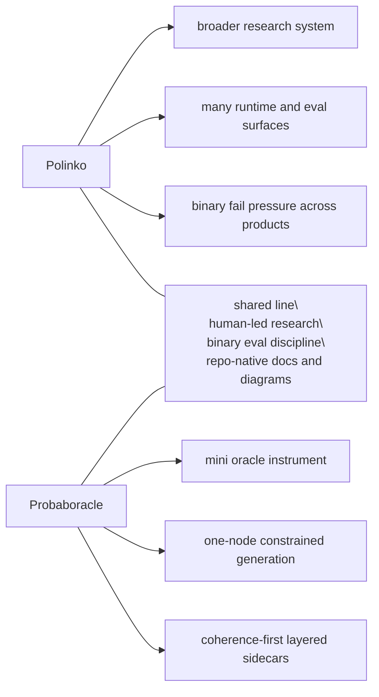

# Research

Probaboracle keeps the tracked research lane small.

This folder is for findings that matter. Each beta is a distinct eval
approach, not a pile of sweeps.

Raw run notes, operator poking, and private scratch material stay in
`docs/peanut/`.

## Read In Order

1. [Beta 1: Product Fit Only](./BETA_1_PRODUCT_FIT.md)
2. [Beta 2: Coherence First](./BETA_2_COHERENCE_FIRST.md)
3. [Beta 3: Coherence + Prompt Relevance](./BETA_3_PROMPT_RELEVANCE.md)
4. [Beta 4: Coherence + Coherent Absurdity](./BETA_4_COHERENT_ABSURDITY.md)

## What Counts As A Beta

- a distinct eval architecture
- a real change in what the verdict is asking
- a method shift worth preserving

Not a beta:

- one more batch
- one more sweep
- one more note on a familiar failure pattern

## Status Map

- `Beta 1`
  - complete
  - useful for product taste, but overloaded as research
- `Beta 2`
  - complete enough to establish the main finding
  - coherence became the real experimental gate
- `Beta 3`
  - complete
  - relevance is now a downstream lens on coherent lines
  - the full corpus is swept for prompt relevance
- `Beta 4`
  - complete enough to establish the class
  - coherent absurdity is a small selective pocket, not a blanket rescue lane

## Polinko Contrast

Probaboracle is part of the same line of work as Polinko, but it is a smaller
instrument.

Mermaid is enough for this pass. If the research surface needs a public visual
artifact later, that is the time to earn a D3 diagram.
