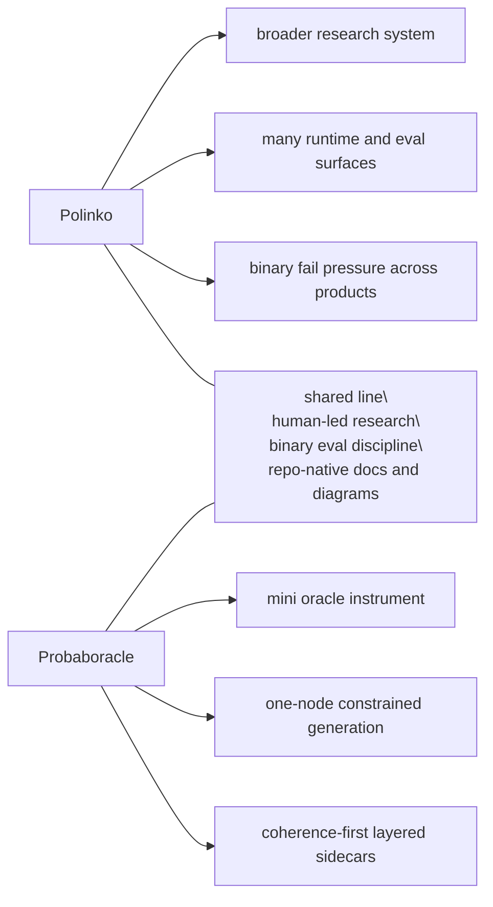

# Research

Probaboracle keeps the tracked research lane small on purpose.

Each beta is a distinct eval approach. This folder preserves the method shifts that changed what the evidence means.

Raw run notes, operator poking, and private scratch material stay in the local `docs/peanut/` lane.

## Current Beta

Current tracked research beta:

- `Research Beta 5.0`
- `retain + evict`

Current question:

When does a recurring fail family stay active evidence versus earn eviction?

Current finding:

- the closing Beta `4.1` `when` rerun covered rows `2737-3391` with
  `286 pass / 369 fail / 0 pending`
- the fail family stayed narrow:
  - `266` `stacked timing fragments`
  - `102` `semicolon pile and unresolved timing drift`
  - `1` `awkward temporal phrasing`
- the coherent-absurdity pocket stayed empty in that closing slice:
  - `0 pass / 0 fail / 0 pending`
- the useful open question has now shifted:
  - not whether `when` still fails
  - but whether the recurring `when` family should stay in `retain` or earn
    `evict`

Current clean lane:

- treat the loop as:
  - `pass / fail`
  - if `fail`, decide `retain / evict`
  - rerun
  - `pass / fail`
- keep tandem serial single-product runs with the queue held at `0`
- `25+` rows as the minimum useful checkpoint
- `50-100` rows, or about one hour, as the real long-run surface
- current state:
  - `retain`
  - no `when` eviction fix is active yet

## Beta Map

| Beta | Question | What Changed |
| --- | --- | --- |
| `Research Beta 1.0` | Does it feel like good Probaboracle? | Product fit shaped the voice, but overloaded one verdict. |
| `Research Beta 2.0` | Is the sentence coherent? | Coherence became the primary experimental gate. |
| `Research Beta 3.0` | Is a coherent line in-lane? | Prompt relevance separated lane control from sentence quality. |
| `Research Beta 4.1` | Can coherent drift still be valuable? | Coherent absurdity became a small selective class. |
| `Research Beta 5.0` | When does a fail family stay active evidence versus earn eviction? | `retain / evict` became the new post-fail decision layer. |

Read in order:

1. [Research Beta 1.0: Product Fit Only](./BETA_1_PRODUCT_FIT.md)
2. [Research Beta 2.0: Coherence First](./BETA_2_COHERENCE_FIRST.md)
3. [Research Beta 3.0: Coherence + Prompt Relevance](./BETA_3_PROMPT_RELEVANCE.md)
4. [Research Beta 4.1: Coherence + Coherent Absurdity](./BETA_4_COHERENT_ABSURDITY.md)
5. [Research Beta 5.0: Retain + Evict](./BETA_5_RETAIN_OR_EVICT.md)

## How To Read The Betas

These betas are research architectures. They are not app release versions, package versions, branch names, or one more sweep.

Each beta marks a real change in what the evaluation is asking:

- `Research Beta 1.0` shaped the product voice
- `Research Beta 2.0` established the core experimental gate
- `Research Beta 3.0` separated lane control from sentence coherence
- `Research Beta 4.1` preserves the selective value of coherent drift while holding coherence to a stricter sentence-resolution bar
- `Research Beta 5.0` separates failure evidence from later runtime correction

Later betas do not erase earlier ones. They narrow what each verdict is allowed to mean.

## Cross-Beta Flow

```mermaid
flowchart LR
  B1["Research Beta 1.0<br/>product fit only"]
  B2["Research Beta 2.0<br/>coherence first"]
  B3["Research Beta 3.0<br/>coherence + prompt relevance"]
  B4["Research Beta 4.1<br/>coherence + coherent absurdity"]
  B5["Research Beta 5.0<br/>retain + evict"]

  S1["one verdict overloaded tone,<br/>sentence quality, and lane control"]
  S2["coherence pulled out as the<br/>primary experimental gate"]
  S3["lane control separated from<br/>sentence coherence"]
  S4["valuable coherent drift preserved<br/>as a selective class"]
  S5["failure evidence separated from<br/>later runtime correction"]

  B1 --> S1 --> B2 --> S2 --> B3 --> S3 --> B4 --> S4 --> B5 --> S5
```

## Plans

Plans are useful, but they are not evidence. They do not become active method until the repo earns them.

Parked lanes:

- provider portability:
  - keep OpenAI-native behaviour stable if the runtime surface later widens
  - leave room for an Azure-compatible path if it becomes necessary
- research visuals:
  - keep per-beta diagrams in tracked docs
  - only add a polished cross-beta Sankey if the era-to-era story needs it
- future betas:
  - promote a new beta only when the eval architecture changes materially
  - do not turn one more sweep into a fake beta

## Polinko Contrast

Probaboracle is part of the same line of work as Polinko, but it is a smaller instrument.

