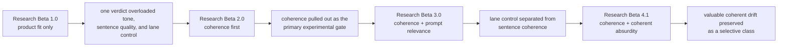
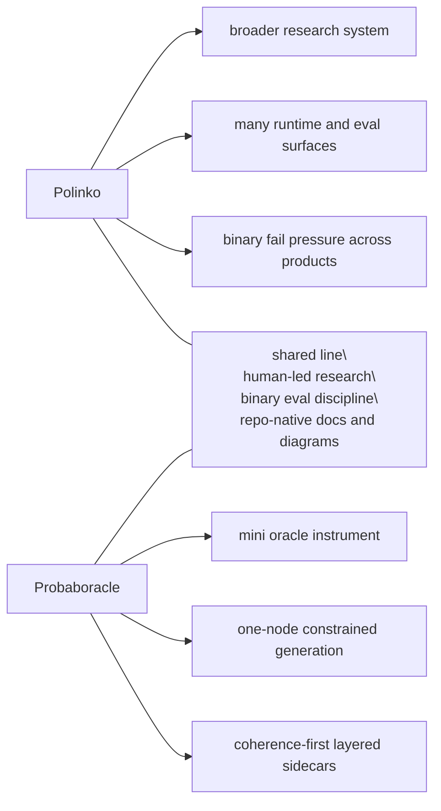

# Research

Probaboracle keeps the tracked research lane small.

This folder is for findings that matter. Each beta is a distinct eval
approach, not a pile of sweeps.

Raw run notes, operator poking, and private scratch material stay in
`docs/peanut/`.

## Use This File For

- Need the beta map:
  - start here
- Need to know which research beta is current:
  - use this file
- Need durable runtime or eval method changes:
  - use `docs/governance/DECISIONS.md`, not this folder

## Beta Semantics

These betas are research architectures.

Minor versions tighten the active method inside the same architecture.

They are not:

- app release versions
- package versions
- branch names
- one more sweep

Each beta marks a real change in what the evaluation is asking and what the
evidence means.

## Beta Map

- `Research Beta 1.0`
  - `product fit only`
  - one binary verdict tried to carry product voice, sentence quality, and lane
    control at once
- `Research Beta 2.0`
  - `coherence first`
  - the primary experiment became sentence coherence inside constrained
    generation
- `Research Beta 3.0`
  - `coherence + prompt relevance`
  - lane control became a downstream lens on coherent lines
- `Research Beta 4.1`
  - `coherence + coherent absurdity`
  - valuable out-of-lane responses became a small selective class rather than
    undifferentiated failure

## Current Beta

- current tracked research beta:
  - `Research Beta 4.1`
- current question:
  - can a coherent out-of-lane line still count as strong oracle behaviour?
- current clean probe:
  - long serial single-product runs when testing the coherent-absurdity gate
- current version turn:
  - stricter coherence threshold inside Beta 4

## Current Finding

- one-node constrained generation can hold sentence coherence under a fixed
  prompt surface
- prompt relevance is a downstream lens, not a proxy for sentence quality
- coherent absurdity is a small selective class:
  - `2 pass / 13 fail` in the meaningful coherence-pass relevance-fail pocket
- the long serial run through row `913` strengthened the stricter coherence
  rule:
  - `when` now splits cleanly between simple one-comma passes and stacked
    temporal fails
- `why` is still the weakest product lane overall, but it can still surface
  rare novel passes:
  - `896`: `apparently a reason, though not in any useful sense.`
  - `913`: `technically a reason, though not in any useful sense.`

## Plans

These are future lanes, not active betas.

- provider portability
  - if the runtime surface widens later, keep OpenAI-native behaviour stable
    while making room for an Azure-compatible deployment path
- research visuals
  - keep the per-beta diagrams in tracked docs
  - add a more polished cross-beta Sankey later if the era-to-era story needs a
    stronger public artifact
- future betas
  - only promote a new beta when the eval architecture changes materially
  - do not turn one more sweep or backlog cleanup into a fake beta

The rule stays the same as Polinko:

- plans are useful
- but they are not evidence
- and they do not become active method until the repo actually earns them

## Cross-Beta Flow

## Read In Order

1. [Research Beta 1.0: Product Fit Only](./BETA_1_PRODUCT_FIT.md)
2. [Research Beta 2.0: Coherence First](./BETA_2_COHERENCE_FIRST.md)
3. [Research Beta 3.0: Coherence + Prompt Relevance](./BETA_3_PROMPT_RELEVANCE.md)
4. [Research Beta 4.1: Coherence + Coherent Absurdity](./BETA_4_COHERENT_ABSURDITY.md)

## What Counts As A Beta

- a distinct eval architecture
- a real change in what the verdict is asking
- a method shift worth preserving

Not a beta:

- one more batch
- one more sweep
- one more note on a familiar failure pattern

## Status Map

- `Research Beta 1.0`
  - complete
  - useful for product taste, but overloaded as research
- `Research Beta 2.0`
  - complete enough to establish the main finding
  - coherence became the real experimental gate
- `Research Beta 3.0`
  - complete
  - relevance is now a downstream lens on coherent lines
  - the full corpus is swept for prompt relevance
- `Research Beta 4.1`
  - complete enough to establish the class
  - coherent absurdity is a small selective pocket, not a blanket rescue lane
  - long serial single-product runs are the cleanest follow-up instrument for
    this beta
  - the current tracked long run is judged through row `913`

## Interpretation Rule

Read these betas by role, not by neatness or badge number:

- `Research Beta 1.0` shaped the product voice
- `Research Beta 2.0` established the core experimental gate
- `Research Beta 3.0` separated lane control from sentence coherence
- `Research Beta 4.1` preserves the selective value of coherent drift while
  holding coherence to a stricter sentence-resolution bar

Later betas do not erase earlier ones. They narrow what each verdict is allowed
to mean.

The diagrams are part of that evidence. The eval pipeline changes are not just
presentation cleanup; they are a visible record of where the method was
actually wrestled into shape.

## Polinko Contrast

Probaboracle is part of the same line of work as Polinko, but it is a smaller
instrument.

Mermaid is enough for this pass. If the research surface needs a public visual
artifact later, that is the time to earn a D3 diagram.
