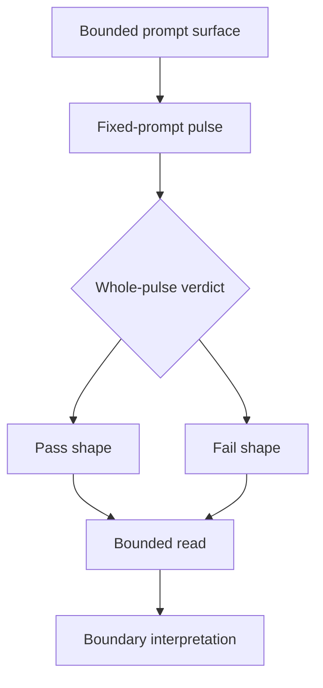

<!-- @format -->

# Boundary Template

Use this for tracked or staged method-boundary docs:

- closed beta notes
- active beta notes
- clean-baseline reset notes
- pre-beta staged notes

## Metadata

| Field | Value |
| --- | --- |
| Code | `NNN_B-NAME`, `NNN_CB-NAME`, or `NNN_PB-NAME` |
| Category | `boundary` |
| Status | `staged`, `active`, or `closed` |
| Last evidence | `YYYY-MM-DD` |
| Owns | one sentence naming the method boundary this doc establishes |

## Headline Shape

- `Research Beta X.Y: Name`
- or `Clean Baseline: Name`
- or `Pre-Beta X.Y: Name`

## Filename Rule

- use `NNN_B-NAME.md` for active or closed beta boundaries
- use `NNN_CB-NAME.md` for clean-baseline or reset boundaries
- use `NNN_PB-NAME.md` for staged pre-beta boundaries
- staged pre-beta boundaries live in the `400-499` range

## Section Order

1. metadata table
2. `What This Beta Asks`
   - or `What This Pre-Beta Asks`
3. `Status`
4. `Eval Shape`
5. `Diagram`
6. `What It Showed`
   - or `What This Would Change`
7. `Why It Matters`
8. `What It Still Cannot Show`
   - or `What It Still Needs`
9. `What Changed Next`
   - or `What Would Promote It`

## Required Boundary Moves

- state the prior closed layer explicitly
- state the current judged object explicitly: one fixed-prompt eval pulse/run
- state what changed in the evidence meaning
- state whether the boundary is staged, active, or closed
- state the exact promotion or close condition

## Default Diagram Shape

## Boundary Questions To Answer

- what was the previous layer?
- what is the new fixed-prompt pulse being judged?
- what does this boundary allow the repo to claim now?
- what still remains out of scope?
- what exact evidence would promote or close the lane?

## Style Rules

- lead with the metadata table
- keep the opening answer short
- use one compact diagram
- keep pulse evidence bounded and explicit
- avoid sprawling recap if the prior beta is already documented elsewhere
