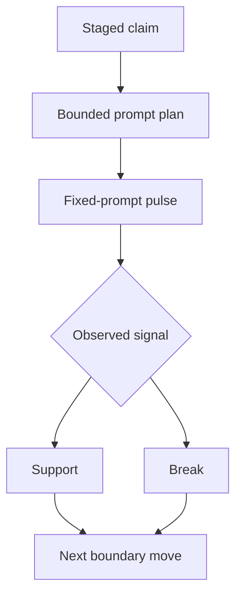

<!-- @format -->

# Hypothesis Template

Use this for staged research claims that are not yet active method boundaries
and not yet live evidence lanes.

## Metadata

| Field | Value |
| --- | --- |
| Code | `NNN_HYPOTHESIS` |
| Category | `hypothesis` |
| Status | `staged`, `testing`, `supported`, `unsupported`, or `retired` |
| Last evidence | `YYYY-MM-DD` |
| Owns | one sentence naming the claim this doc is testing |

## Headline Shape

- `Hypothesis: Name`
- or `Method Hypothesis: Name`
- or `Prompt Hypothesis: Name`
- or `Pulse Hypothesis: Name`

## Section Order

1. metadata table
2. `Question`
3. `Current Claim`
4. `Source Shape`
5. `Diagram`
6. `What Would Support It`
7. `What Would Break It`
8. `Why It Matters`
9. `Next Move`

## Required Hypothesis Moves

- state the exact claim in one sentence
- state the judged object explicitly: one fixed-prompt eval pulse/run
- name the bounded prompt or pulse source shape needed to test it
- define what counts as support and what counts as failure
- state whether the hypothesis should promote, narrow, or retire if confirmed

## Default Source Table

| Claim | Source shape | Judged object | Support signal | Break signal |
| --- | --- | --- | --- | --- |
| example prompt claim | fixed-prompt pulse | whole-pulse verdict | compact success read | compact failure read |

## Default Diagram Shape

## Hypothesis Questions To Answer

- what exact claim is being tested?
- what bounded prompt/pulse source would test it fairly?
- what result would count as support?
- what result would count as a break?
- what should happen if the claim holds?

## Style Rules

- lead with the metadata table
- keep the claim tighter than the plan
- use tables for support and break conditions
- avoid turning the doc into a backlog dump
- keep `Next Move` to the immediate test surface
